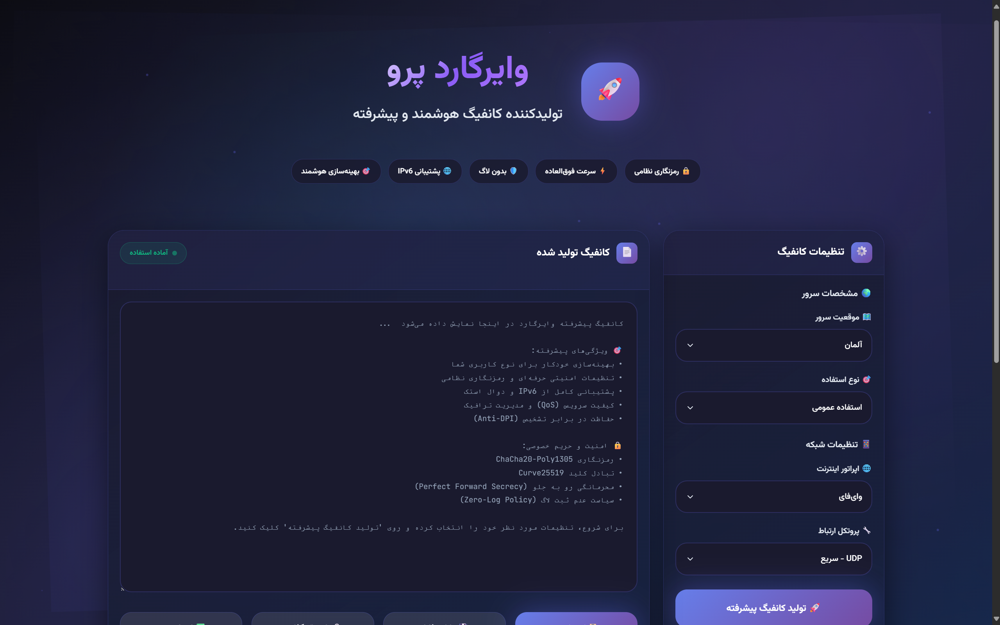

# 🚀 WireGuard – پنل هوشمند تولید کانفیگ (Client-Side)

یک پنل وب پیشرفته و هوشمند برای تولید کانفیگ‌های بهینه و امن وایرگارد که کاملاً در سمت کاربر (Client-Side) و بدون نیاز به سرور اجرا می‌شود.

---

## 🌐 نسخه آنلاین
👉 [WireGuard](https://devartery.github.io/WireGuard/index.html)

---

## ✨ ویژگی‌ها
- موتور بهینه‌ساز هوشمند برای تنظیم خودکار MTU, DNS, PersistentKeepalive بر اساس سناریو (گیمینگ/استریم/…)
- امنیت بالا: تولید کلیدها (Private/Public) به‌صورت کامل در مرورگر؛ هیچ داده‌ای به سرور ارسال نمی‌شود
- خروجی کامل: کپی سریع، دانلود فایل .conf، اشتراک‌گذاری و اعتبارسنجی
- پروفایل‌های آماده: Gaming / Streaming / Mobile / Balanced
- رابط کاربری واکنش‌گرا و سبک

---

## 🖼 پیش‌نمایش

---

## 📌 نحوه استفاده
1. وارد صفحه وب پروژه شوید (لوکال یا GitHub Pages).  
2. پروفایل موردنیاز (Gaming/Streaming/…) را انتخاب کنید.  
3. در صورت نیاز MTU/DNS/Keepalive را سفارشی کن.  
4. روی Generate بزن؛ کلیدها در همان مرورگر شما ساخته می‌شوند.  
5. کانفیگ را کپی کنید یا **فایل .conf** را دانلود کنید.  
6. با اعتبارسنجی داخلی، تنظیمات را چک کنید.

---

## ⚙️ گزینه‌های پیشرفته (Advanced)

- MTU  
  تعیین خودکار بر اساس شبکه کاربر (با امکان تغییر دستی)

- DNS  
  انتخاب سرورهای امن (DoH / DoT) یا وارد کردن DNS سفارشی

- PersistentKeepalive  
  پیشنهاد هوشمند بر اساس نوع شبکه (NAT / موبایل)

- AllowedIPs / Endpoint  
  قالب‌های از پیش‌تعریف‌شده به همراه حالت سفارشی برای کاربران حرفه‌ای

---

## 🔒 امنیت
- تمام عملیات کلیدزایی و ساخت کاندر مرورگر شماما** انجام می‌شود.  
- هیچ داده‌ای به هیچ سروری ارسال/ذخیره نمی‌شود.  
- رمزنگChaCha20-Poly130505** مطابق استاندارد WireGuard.

---

## 🗺 نقشه راه (Roadmap)
- پروفایل‌های بیشتر اپراتوری  
- تم‌های تیره/روشن  
- Import/Export پروفایل‌ها (JSON)  
- i18n (چندزبانه)

---

## 🤝 مشارکت
پذیرای PR/Issue هستیم:
1. ریپو را Fork کن
2. Branch بساز (feat/... یا fix/...)
3. Commit/Push و PR ثبت کن

---

## 📬 ارتباط
- 👤 سازنده: [@DevArtery](https://t.me/DevArtery)  
- 📢 کانال تلگرام: [@ownerArtery](https://t.me/ownerArtery)

---

## 📄 لایسنس
این پروژه تحت مMITIT** منتشر شده است. متن کامل مجوز در فایل [LICENSE](./LICENSE) موجود است.
